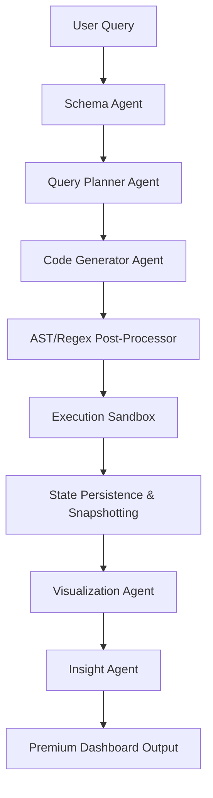

# AeroAnalyst AI

### LangGraph-Powered Multi-Agent Data Analysis Platform

**AeroAnalyst AI** is an advanced, production-ready data analysis application that orchestrates an autonomous network of AI agents to inspect, query, mutate, and visualize tabular datasets. It features a self-correcting code execution sandbox, stateful snapshot management, and a premium modern user interface.


---

## 🚀 Key Technical Highlights (Resume Showcase)

### 1. Multi-Agent Orchestration (LangGraph & LangChain)
- Architected a **stateful multi-agent system** using **LangGraph** that decomposes natural language user queries into distinct steps executed by specialized agents:
  - **Schema Parser**: Analyzes data structures, missing values, and column types.
  - **Query Planner**: Translates ambiguous user queries into structured JSON logic.
  - **Code Generator**: Generates pandas-based data-wrangling code.
  - **Sandbox Executor**: Runs generated code safely and returns results.
  - **Insight Agent**: Distills raw output into human-readable data narratives.

### 2. Self-Correcting Code Execution Sandbox
- Implemented a secure Python `exec()` runtime sandbox for dynamic data mutations.
- Engineered a **regex-based AST post-processing pipeline** that intercepts common LLM coding syntax errors in real-time (such as incorrect chained indexing, invalid attribute assignments like `.values[0] = ...`, and incorrect date comparisons) to guarantee successful runtime execution.

### 3. Stateful Mutation & Snapshot Persistence
- Designed a robust FastAPI database schema (PostgreSQL/SQLAlchemy) that tracks conversations and logs query execution history.
- Built a **stateful snapshot system** that duplicates dataset snapshots upon initiating a conversation, allowing users to safely perform non-destructive mutations (e.g., adding rows, updating cells, dropping duplicates) directly on local CSV files.

### 4. High-Performance Glassmorphic UI
- Developed a highly interactive dark-mode dashboard using **Vanilla CSS3** and **Vanilla JavaScript** (zero external frontend frameworks to minimize bundle size).
- Engineered a responsive sidebar navigation system equipped with smooth bezier animations (`cubic-bezier(0.4, 0, 0.2, 1)`) and collapse state handling.

---

## 🛠️ System Architecture



---

## 💻 Tech Stack

- **AI & LLM Network**: LangGraph, LangChain Core, HuggingFace Hub, Meta-Llama-3-8B-Instruct
- **Backend & Database**: FastAPI, SQLAlchemy, PostgreSQL, Python-Dotenv
- **Data Engineering**: Pandas, NumPy, Scikit-Learn
- **Visualization**: Matplotlib, Seaborn
- **Frontend**: HTML5, Vanilla CSS3 (Custom Variables, CSS Gradients, Bezier Transitions), ES6 JavaScript

---

## ⚙️ Setup & Execution

1. **Configure Environment**:
   Initialize database credentials and Hugging Face endpoint token in `.env`.

2. **Start Database**:
   Verify PostgreSQL instance is active and databases are migrated.

3. **Launch Server**:
   Start the FastAPI development server:
   ```bash
   .\venv\Scripts\python.exe -m uvicorn server:app --host 127.0.0.1 --port 8000
   ```
   Open `http://127.0.0.1:8000` to interact with the application.